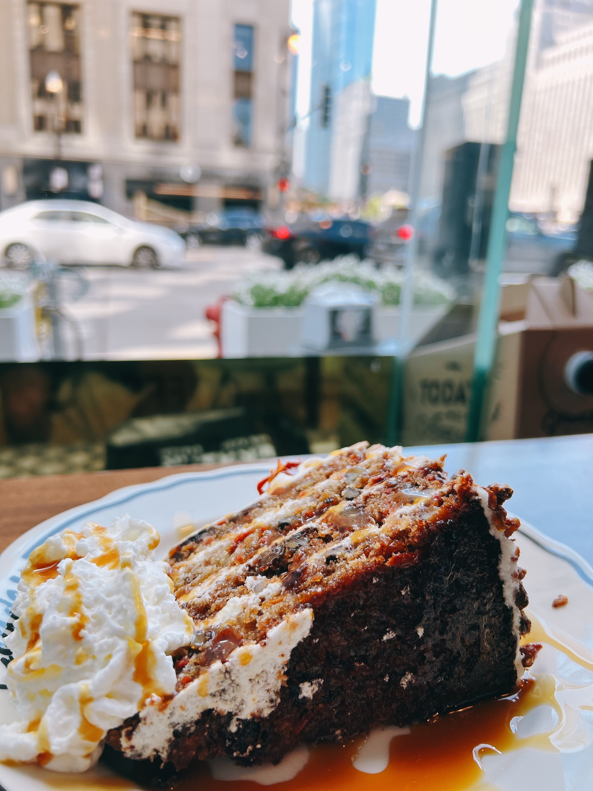
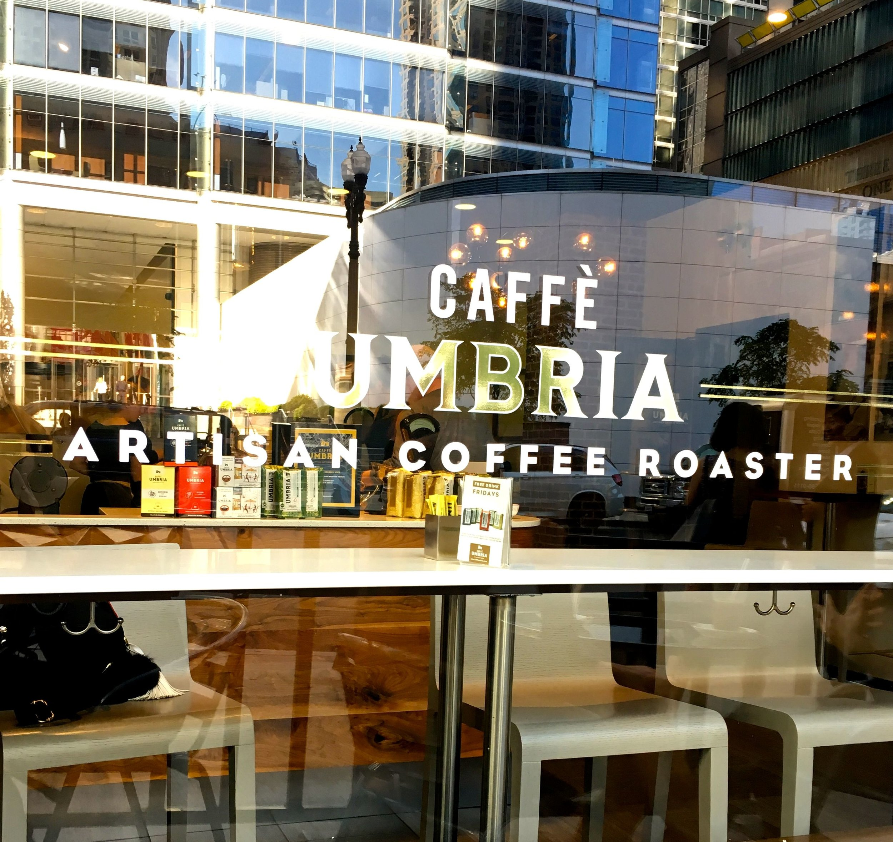
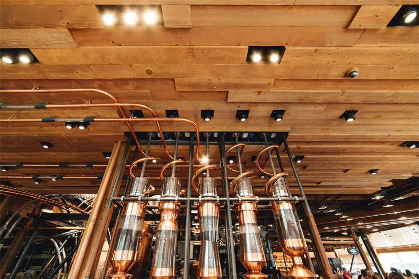

```{r setup, include=FALSE}
knitr::opts_chunk$set(echo = TRUE)
```


## Chicago has a good list of coffee shops, a set shopped, and more to discover. 

The trip to Chicago is always fun. Take a peak on what attracts coffee lovers. This lists of coffee shops are have-to-go. I tried them, all are tasty.

### Sawada in West Loop


### Goddess and the Baker

{width=50% height=50%}

{width=50% height=50%}

### Caffe Umbria

{width=50% height=50%}

### Mojo
{width=50% height=50%}

### Blue Bottle

{width=50% height=50%}

### Startbucks Roastery 

{width=50% height=50%}

{width=50% height=50%}


