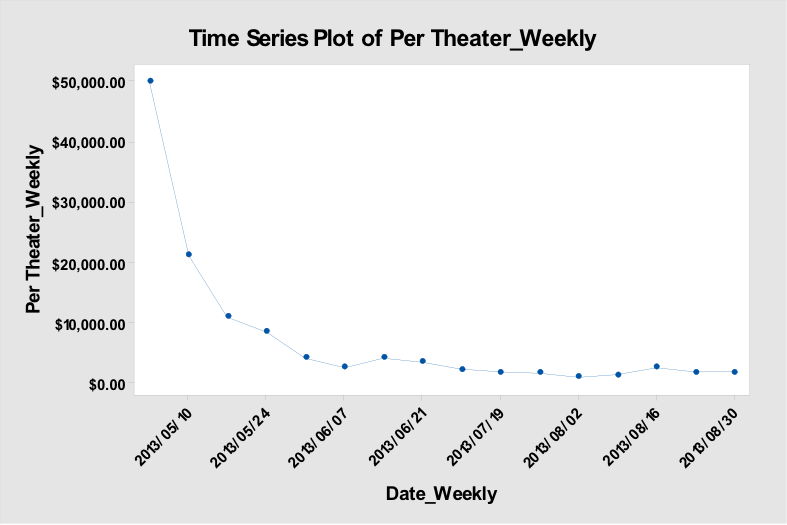
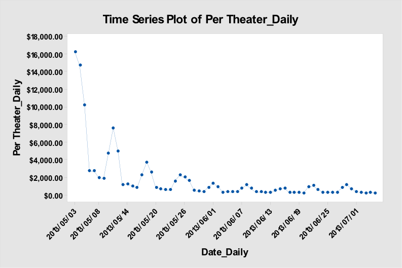
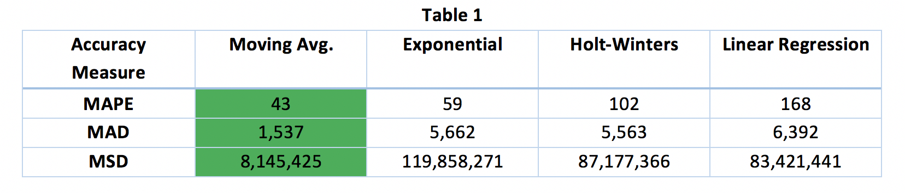
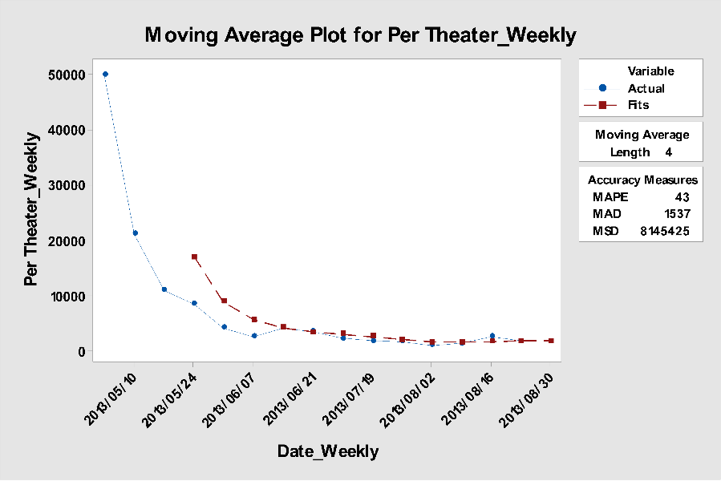
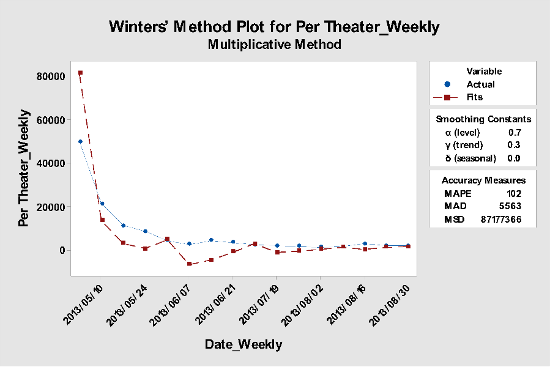
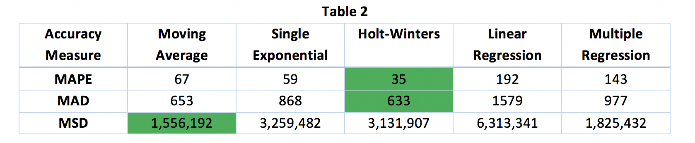
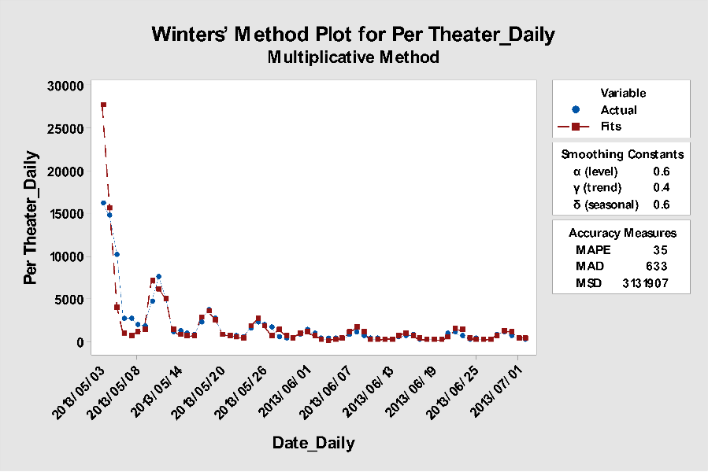
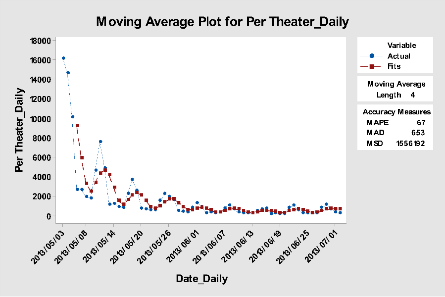

```{r setup, include=FALSE}
knitr::opts_chunk$set(echo = FALSE)
```


# Motivation

Movies have been a source of entertainment for people over years. Summertime superhero blockbusters typically bring excitement to an otherwise calm time. Theaters can rake in huge sums of money on these types of movies. In particular the movie Iron Man 3 released on May 3r 2013 provides a great example of this phenomenon. The box of ticket sales of this movie have been analyzed to ft the best time series plot possible to attempt to approximate future movie ticket sales for movies of this type.

# Methodology

To complete the analysis data on ticket sales were gathered from <https://www.the-numbers.com/> for Iron Man 3. Daily and weekly per-theater ticket sales were collected and fitted to several time series models. The models included moving average single exponential  Holt-t Winters simple linear regression and multiple linear regression. Each model was judged based on three accuracy measures: MAD MAPE and MSD. The best model for each type of data (daily and weekly) was selected and recommended to be used in the prediction of future movie releases.

# Results and Analysis

For the Time Series Plot of Weekly Per Theater Ticket Sales (Figure 1)r there is a decreasing trend. The value of per-theater ticket sales decreases until a certain point before leveling out about 5 weeks after release. There is no cyclical or seasonal effect that can be found from the time series plot and the plot looks fairly smooth. For the week 2013/5/24 and the week 2013/08/16r there were slight increasing in both weeks the reason of increasing in May could be the end of semester and students throwing parts after finals. In August good weather and nearing the end of summer breaks may play a factor.



The Time Series Plot of Daily Ticket Sales (Figure 2), overall there is a decreasing trend starting from May and almost leveled off in June. There is a seasonal variation can be found for daily because people are more likely to go to movies on weekends than weekdays. The seasonal variation shows a 7-day repeating pattern with 3-day peak, representing Friday, Saturday and Sunday, which more people prefer to go to movies on.





## Weekly

For the weekly ticket sales, analysis was conducted for the moving average, exponential smoothing, Holt-Winters, and simple linear regression models with accuracy measures shown in Table 1. Based on these accuracy measures, the moving average was by far the best model, as seen in Figure 3. All three accuracy measures were the lowest of any model. The moving average model was fit with an MA length of 4 and the moving averages were centered. 

The exponential model was fit using an alpha of 0.8. Initial attempts to optimize ARIMA to find an ideal alpha did not work, as Minitab threw an error code. After adjusting the alpha value through several iterations, a value of 0.8 was selected as the best. With this value, the model was still objectively worse than the moving average in all accuracy measures. 







The same process was used (multiple iterations to find the best values) for the Holt-Winters method with a final model using an alpha of 0.8, a gamma of 0.3, and a delta of 0. The delta was selected to be 0 because the weekly ticket sales showed no seasonal trend. This model was again worse than the moving average.

Finally, a simple linear regression was constructed. The model fit the data to the equation TicketSales = 21943 – 1715*(days after release). This model was calculated to have worse accuracy measures than the moving average. A multiple regression, using seasons as categorical variables, was not conducted as there was no seasonal trend for the weekly dataset. As such, trying to force a fit on that data set would not be effective. 

Overall, the moving average model was best for the weekly, per-theater ticket sales for Iron Man 3. This model had the best accuracy measures and makes sense. The sales values level off very quickly and stay effectively horizontal for most of the plot, which the moving average model handles well. Additionally, none of the models handled the first few data points very well, and the moving average had the benefit of not starting to fit points until the third week, due to the nature of the analysis. 

As a secondary option, the Holt-Winters model also fit the data reasonably well (Figure 4). While there was a large overprediction for the first week, and some underprediction for the following several weeks, the model did a good job tracking the trend and pattern of the ticket sales. The sort of decay pattern is matched well, despite not having any seasonal effect (which the Holt-Winters tries to model). Additionally, this model had the second best MAD, and MSD. 




## Daily

For daily ticket sales, the analysis found slightly different results. As mentioned above, the daily ticket sales showed a definite seasonal pattern, and this makes sense. Weekends will have much higher box office sales than weekdays. As such, a model that could take seasonality into account would likely be much better.

This tended to show true as the Holt-Winters method had the best accuracy measures in two out of three cases (the MAPE and MAD were best for Holt-Winters). The Holt-Winters model, as seen in Figure 5, was able to handle the seasonality, which the moving average and single exponential could not do. They both had accuracy measures much higher than the Holt-Winters method.





Regression models were also fit with a single regression model having an equation of TicketSales = 4821 - 99.1(days since release). This model fit very poorly, however, due to the seasonality of the data a multiple regression model was also fit. Days since release was used as a continuous predictor with days of the week used as categorical predictors. The best equation was found by including a second-order term for days since release and using an interaction between days since release and days of the week. The actual equation was found to be the following, based on day of the week:

Sunday Daily Ticket $$Sales = 9544 - 413.8 (Days Since Release) + 4.530 (Days Since Release)^2 $$

Monday Daily Ticket $$Sales = 5067 - 324.1 (Days Since Release) + 4.530 (Days Since Release)^2$$

Tuesday Daily Ticket $$Sales = 5216 - 331.3 (Days Since Release) + 4.530 (Days Since Release)^2$$
Wednesday Daily Ticket $$Sales = 4474 - 304.0 (Days Since Release) + 4.530 (Days Since Release)^2$$
Thursday Daily Ticket $$Sales = 4671 - 310.7 (Days Since Release) + 4.530 (Days Since Release)^2$$
Friday Daily Ticket $$Sales = 10803 - 447.1 (Days Since Release) + 4.530 (Days Since Release)^2$$
Saturday Daily Ticket $$Sales = 12051 - 464.4 (Days Since Release) + 4.530 (Days Since Release)^2$$

This regression equation had accuracy measures calculated manually to be 143; 977; and 1,825,432 for the MAPE, MAD, and MSD, respectively. These measures were objectively worse than those for other models, so the multiple regression model was not used.

The moving average was selected as an alternate model (Figure 6), as its accuracy measures were generally good. It had the best MSD, second best MAD, and third MAPE of all the models. While this model did not do great in the first week, it steadied out and modeled the relative flatness of later ticket sales pretty well.  





# Conclusion

By using the data collected from <http://www.thenumbers.com> of the movie The Iron Man 3, different times series models were generated including moving average, single exponential smoothing, Holt-Winters, simple linear regression, and multiple linear regression. For the weekly ticket sales, based on the analysis among all models, a moving average should be chosen because it had the best accuracy measures (MAPE, MAD, and MSD). For the daily ticket sale, there is not just a trend, but a seasonal pattern within the time series. So, the Holt-Winters method did a good job on predicting ticket sales. With this information, it is fair to assume that in the prediction of future movie ticket sales, a moving average would be best to determine weekly ticket sales and a Holt-Winters model would be best for daily ticket sales. Unfortunately, neither model did a great job of predicting opening day/week sales, but the models steadied after that. So, in conclusion the models mentioned above are useful in predicting ticket sales for summer blockbuster superhero movies, and may be useful in predicting sales for all movies; however, the prediction is limited to times beyond the opening week.

