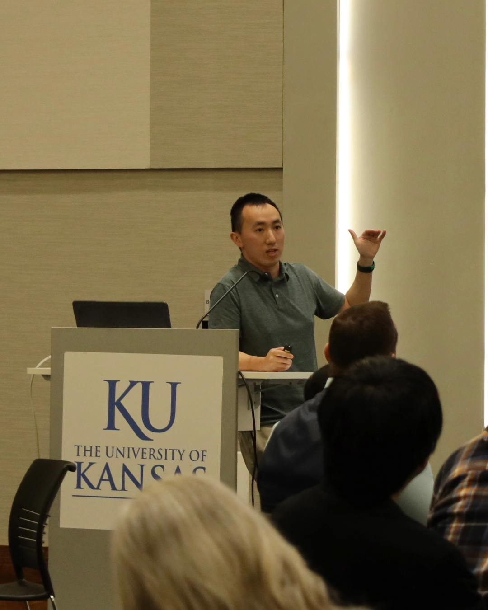

```{r setup, include=FALSE}
knitr::opts_chunk$set(echo = FALSE)

# Learn more about creating websites with Distill at:
# https://rstudio.github.io/distill/website.html

```

{width=30%}

## About me:
I am a PhD candidate at the School of Public Affairs and Administration, University of Kansas. I have a undergraduate background in mathematics and a master's degree in applied urban planning. I spent first h
My very shallow knowledge in climate change science makes wonder what human beings can do to alleviate the suffering even with irreversible climate change effects. Combining my previous trained experience in math and urban planning, I build models to analyze the effectiveness of local planning policy in mitigating and adapting climate change. 

## Education:
B.S. in Mathematics, University of Wisconsin-Platteville

M.U.P. in Urban Planning, University of Kansas, Lawrence

## Language
Chinese and English 

